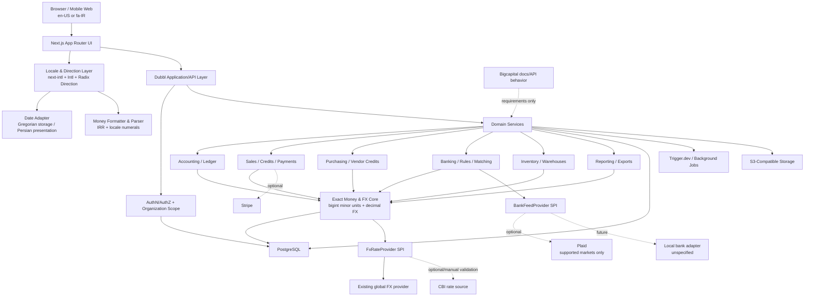
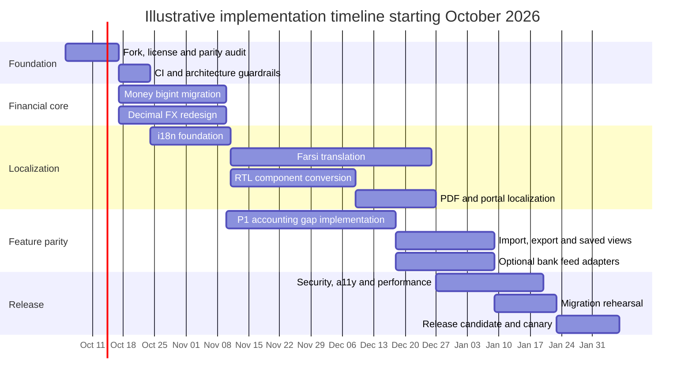

# Implementation Plan: Fork Dubbl, Reach Bigcapital Feature Parity, and Add Production-Grade Persian/IRR/RTL Support

## Executive summary

### Recommended direction

The safest and most efficient implementation strategy is to **fork Dubbl as the product and architecture baseline, then reimplement only the valuable Bigcapital capabilities that are missing or materially better**, rather than merging the two codebases. Dubbl is already a substantial accounting platform: its repository describes double-entry bookkeeping, invoicing and quotes, bills and purchasing, bank reconciliation, expenses, inventory and warehouses, payroll, projects, CRM, fixed assets, budgets, tax, reports, multi-currency, document storage, audit trails, REST APIs, and an MCP server. Its present stack is Next.js/React/TypeScript with PostgreSQL and Drizzle, and its repository includes Docker-based self-hosting.  

Bigcapital's public API exposes a broad accounting surface—items, inventory adjustments, branches, warehouses, inventory costing, invoices, PDF templates, attachments, tax rates, payments, imports, payment links, Stripe, categories, expenses, warehouse transfers, customers, vendors, estimates, sale receipts, bills, landed costs, journals, credit-note workflows, vendor-credit workflows, banking/Plaid, categorization, matching, transaction locking, reports, roles, subscriptions, export, saved views, currencies, users, and contacts.  A spot audit of current Dubbl shows that **many of these are already implemented**, sometimes beyond what its README advertises: Dubbl already has bank rules, automated categorization, reconciliation matching, warehouse transfers, payment links, period locks, multi-currency rate infrastructure, and sales-receipt UI plumbing.      

Therefore, the project should be framed as a **Bigcapital-to-Dubbl parity audit plus selective clean-room implementation**, not as a literal "port everything."

The most important technical finding is that **Persian translation and RTL are not the hardest part of IRR support; Dubbl's money representation is**. Dubbl correctly has newer currency-aware helper functions, but substantial code still speaks in "cents", uses fixed `/100` conversions, and stores core journal amounts in PostgreSQL `integer` columns.     PostgreSQL `integer` is a four-byte integer, while `bigint` exists for values outside that range and `numeric` provides arbitrary exact precision.  This matters acutely for IRR: the Central Bank of Iran's October 2026 official exchange-rate page expresses rates in very large rial amounts—for example, its October 1, 2026 page showed USD well over one million IRR—while Dubbl currently represents some FX rates as integers scaled by `1,000,000`.   Using a six-decimal scaled 32-bit `integer` is therefore unsuitable for IRR exchange-rate magnitudes, and 32-bit monetary amount columns themselves are too small for serious rial accounting.

**Money-storage hardening must precede the Farsi production release.**

The localization recommendation is to add `next-intl`, initially **without locale-prefixed URLs**, persisting locale in a user preference/cookie. That preserves current Dubbl URLs and minimizes backward-compatibility risk; `next-intl` officially supports App Router applications where locale comes from a cookie or user setting instead of locale-based routing.  Persian messages should use ICU Message syntax and CLDR plural categories; Persian cardinal plural rules classify `0` and `1` as `one` and the remaining normal integers as `other`, which differs from English. 

For RTL, set structural direction with `dir="rtl"` at the document root for Farsi; use `dir="auto"` or bidi isolation around user-entered/mixed-script fields; replace physical left/right CSS with logical start/end properties. These approaches follow W3C bidi guidance and are supported directly by Tailwind's logical utilities and Radix's Direction Provider. 

For IRR, use ISO code `IRR` and a **zero-decimal display policy**, consistent with current CLDR currency data.  Do not silently use toman. As of October 2026, the Central Bank's own current site still identifies the Iranian currency unit as the Rial, despite the legally approved redenomination plan that removes four zeros; Reuters reported in October 2025 that the Central Bank could have up to two years to prepare and that a multi-year dual-denomination transition would follow.  Consequently, currency architecture should support **currency regimes/effective dates and redenomination factors**, rather than permanently assuming today's rial scale.

### Explicit assumptions

| Assumption | Plan treatment |
|---|---|
| Dubbl `master` as reviewed on October 2, 2026 is the implementation baseline | Yes |
| Bigcapital is a behavioral/reference source, not a source-code donor | Yes |
| Existing Dubbl data must remain valid | Required |
| Existing `/api/v1` clients should not break unnecessarily | Required; use expand/dual-read/contract migrations |
| User-facing base currency is IRR/Rial, not toman | Assumed from the request |
| Toman display/input convenience is required | **Unspecified**; make it an optional later preference |
| Persian UI is required | Yes |
| Persian Solar Hijri calendar is required for presentation | Recommended; exact statutory accounting-calendar requirements are **unspecified** |
| Iranian statutory tax/payroll/e-invoicing compliance is required | **Unspecified and not included automatically** |
| An official, machine-supported CBI FX feed/API is available | **Unspecified; do not assume it** |
| Cloud/hosting jurisdiction | **Unspecified** |
| Iranian businesses/persons will use US-based payment/banking providers | **Must not be assumed**; legal/service availability needs separate review |
| Accessibility target | WCAG 2.2 AA |
| Clean-room reimplementation can be used for Bigcapital parity | Assumed and strongly recommended |
| Start date for the illustrative timeline | October 5, 2026 |

A realistic target for the complete program is approximately **22–30 calendar weeks with a focused 4–6 person team**, or roughly **65–90 engineering/QA/localization person-weeks**. A solo implementation is more plausibly a **45–70+ week engineering effort**, depending heavily on how many Bigcapital "gaps" survive the initial parity audit.

## Baseline, prerequisites, licensing, and feature mapping

Dubbl and Bigcapital should be treated as fundamentally different architectures. Dubbl's current repository uses Next.js App Router, PostgreSQL/Drizzle, authentication through NextAuth/Auth.js-style infrastructure, Tailwind/shadcn/Radix components, and Trigger.dev for scheduled/background work. Its documented prerequisites are Node.js 20+ and PostgreSQL 15+, while its current production Dockerfile actually builds from `node:22-alpine`; its production Compose file runs PostgreSQL 16.   

Bigcapital is a Lerna/pnpm monorepo with separate web/server/shared packages, and its documented deployment architecture uses distinct MySQL tenant databases, a system database, Redis, MongoDB for Agenda job metadata, an API server, and an Nginx-facing SPA.   **Do not transplant that architecture into Dubbl merely to gain Bigcapital features.** Implement the business capabilities inside Dubbl's existing domain/API/PostgreSQL organization model unless a measured scaling requirement justifies architectural change.

### License prerequisite

This deserves a release-blocking work item.

Dubbl is Apache-2.0 licensed, while Bigcapital's repository contains the GNU AGPL v3 license.   Apache's own licensing guidance describes compatibility as one-way: Apache-2.0 code can enter a GPLv3 work, but GPLv3-covered code cannot simply be incorporated into an Apache-licensed project while retaining Apache-only distribution.  AGPL additionally targets network-served software.

Accordingly:

**Fork Dubbl. Do not copy Bigcapital implementation code into the Apache-licensed fork.** Use Bigcapital's public documentation, publicly observable behavior, API contracts, and feature concepts as requirements, then write original implementations. Maintain a provenance log showing which capability was independently implemented and which public specification informed it. If you intend to copy or adapt AGPL implementation code, stop and obtain open-source legal advice before continuing; that would materially change the licensing plan.

### Bigcapital-to-Dubbl feature map

The first milestone must turn this table into an executable parity matrix with API/UI/schema links. The mapping below is based on Bigcapital's documented API catalog and a targeted inspection of Dubbl, not an exhaustive function-by-function audit. Bigcapital's official API catalog is the authoritative scope list. 

| Bigcapital capability | Current Dubbl assessment | Recommended action | Priority |
|---|---|---|---|
| Auth, users, roles, organization, settings | Core equivalents already exist in Dubbl; access controls and organization scoping are pervasive.  | Compare permission granularity/API behavior; do not rewrite | P1 audit |
| API keys | Dubbl advertises REST/API-key capabilities.  | Parity/security audit | P1 audit |
| Items and item categories | Inventory/item functionality exists | Verify category hierarchy/filter parity | P2 |
| Inventory adjustments | Stock takes/adjustments already broadly represented | Behavioral parity tests only unless gap found | P2 |
| Warehouses | Existing | Preserve Dubbl model | P1 audit |
| Warehouse transfers | Confirmed UI/API/domain behavior in Dubbl.  | No port; compare partial-receipt/cancellation behavior | P1 audit |
| Inventory costing | Dubbl has valuation functionality.  | Compare costing methods/reports | P1 |
| Branches | Exact `branchId` parity was not found in the targeted audit | **Likely net-new dimension:** branch entity, permissions, document/report filters | P1 if multi-branch required |
| Accounts/chart of accounts | Already core Dubbl | No port | Existing |
| Manual journals | Already core Dubbl | No port | Existing |
| Tax rates | Existing tax module | Audit rounding/jurisdiction behavior | P1 |
| Sale invoices | Existing | No wholesale port | Existing |
| Sale estimates | Dubbl has quotes | Map terminology/status differences | P2 |
| Sale receipts | Sales-receipt paths/types appear in current Dubbl UI code.  | Validate accounting postings and API parity | P1 audit |
| Payments received | Existing payment tracking | Compare allocations/overpayments | P1 |
| Credit notes | Existing | Audit refund/apply workflows | P1 |
| Credit-note refunds | Core credit notes exist; exact Bigcapital workflow needs verification | Add explicit refund ledger/state flow if missing | P1 |
| Apply credit note to invoice | Verify exact allocation model | Implement explicit allocation entity if absent | P1 |
| Bills | Existing | No wholesale port | Existing |
| Bill payments | Existing AP capability | Verify allocations and partial-payment behavior | P1 |
| Vendor credits | No exact equivalent was identified by the targeted repository search | **Candidate net-new feature** | P1 |
| Apply vendor credits to bills | Dependent on vendor-credit model | Add with allocation/audit trail | P1 |
| Vendor-credit refunds | Dependent on vendor-credit model | Add after vendor credits | P1 |
| Landed cost | Existing in Dubbl | Audit inventory-cost capitalization behavior | P1 |
| Expenses | Existing | No wholesale port | Existing |
| PDF templates | Dubbl has document/PDF generation | Localize and make RTL-safe rather than replace | P1 |
| Attachments | Existing document/storage subsystem | Compare attachment linkage/permissions | P2 |
| Payment links | Confirmed in current Dubbl, including token endpoints and invoice flow.  | Harden/localize | P1 |
| Stripe/payment services | Dubbl already has Stripe and Connect environment configuration.  | Preserve as optional global connector | P2 |
| Bank accounts | Existing | No port | Existing |
| Banking transactions | Existing | No port | Existing |
| Categorization | Existing bank rules/coding | Compare rule operators and UX | P1 |
| Bank rules | Confirmed schema/UI/API and rule application during imports.  | Behavioral parity only | Existing |
| Uncategorized/pending/recognized states | Dubbl has substantial reconciliation workflow, but status semantics need direct mapping | Normalize states only where useful | P1 audit |
| Transaction matching | Dubbl already matches bank transactions against invoices, bills, journal lines and transfers.  | Keep; compare matching heuristics | Existing |
| Plaid | No Plaid implementation was found in the targeted Dubbl audit | Add optional provider behind bank-feed adapter | P2 globally |
| Transaction locking | Dubbl already has soft/advisor period-lock semantics.  | Keep Dubbl implementation unless Bigcapital exposes a needed rule | Existing |
| Import | Bank CSV import exists | Add generalized object imports only where missing | P1 |
| Export | Exact general Bigcapital-style export coverage needs audit | Standardize CSV/XLSX exports | P2 |
| Saved views | **Unspecified after spot audit** | Add reusable filter/sort/column definitions if absent | P2 |
| Reports/dashboard | Dubbl already advertises 25+ reports and reporting functionality | Compare missing named Bigcapital reports only | P1 audit |
| Currencies | Dubbl already has currency catalog, rates and conversion services.  | **Refactor for IRR scale, precision and localization** | P0 |
| Subscriptions | Dubbl contains Stripe plan/billing configuration.  | Only pursue Bigcapital parity if operating SaaS | P3 |
| Misc/API convenience endpoints | Unknown until contract diff | Port only demonstrated business value | P3 |

This mapping changes the implementation order significantly. **Do not spend months reimplementing bank rules, payment links, warehouse transfers, matching, locking, or other features already present.** Spend those weeks on correctness gaps, Persian support, vendor-credit/branch/general-data tooling gaps, and IRR-safe accounting.

Bigcapital's Plaid functionality is also not an Iranian bank integration. Plaid currently documents coverage in the US, Canada, the UK, and European markets—not Iranian banking institutions.  For an Iran-focused installation, preserve CSV/manual imports and design a generic `BankFeedProvider` interface for any future locally permissible connector rather than coupling the accounting domain to Plaid.

## Target architecture, money model, Persian localization, RTL, and accessibility

The fundamental architectural rule is **domain reuse, adapter extension**. Bigcapital is a specification/reference. Dubbl remains the runtime.



### Money and database architecture

This is the P0 refactor.

Dubbl's `lib/money.ts` has already moved conceptually toward currency-aware minor units, but still exposes fixed-decimal `centsToDecimal`, `decimalToCents`, and `parseMoney`, while other pages directly divide amounts by 100.   Journal debit and credit fields are currently PostgreSQL `integer` columns, and recurring/accounting code explicitly calls its values "integer cents." 

The target model should be:

| Concern | Target |
|---|---|
| Stored monetary amount | Exact integer **minor units**, not "cents" |
| DB type | PostgreSQL `bigint` for money |
| Application representation | `bigint`, or safe-number compatibility wrapper during transition |
| API representation long-term | Decimal string or minor-unit string + currency |
| IRR minor units | `0`, matching current CLDR currency data.  |
| FX rates | PostgreSQL `numeric(38,18)` or similar exact decimal |
| FX application type | Decimal library / string-safe arithmetic; no binary float accounting calculations |
| Rate direction | Explicit: `quoteCurrency units per 1 baseCurrency` |
| Rate provenance | provider, external identifier, observed-at, effective date, imported-at |
| Rounding | Currency-specific, operation-specific explicit policy |
| Historical currencies | Do not mutate posted entries |
| Redenomination | Separate currency-regime/version concept |

Using `bigint` for amounts does **not** require multiplying or dividing existing USD/EUR records. An existing USD value of `1250` already means 1,250 minor units, i.e. USD 12.50. After migration it remains `1250`; only the physical DB range changes. An IRR value of `1250` means IRR 1,250 because IRR has zero fractional display digits.

Use a codebase-wide rename over time:

```text
amountCents        -> amountMinor
unitPriceCents     -> unitPriceMinor
debitAmountCents   -> debitMinor
creditAmountCents  -> creditMinor
sumCents()         -> sumMinorUnits()
decimalToCents()   -> decimalToMinorUnits(value, currency)
```

Keep deprecated wrappers temporarily to reduce migration blast radius, but forbid new business code from using them.

FX rates need a separate migration. Dubbl currently uses a `1_000_000` scale in its rate tooling and entry schema.  This is an especially poor representation for IRR because one direction can be extremely large while its reciprocal is extremely small. Use exact decimal rates instead of merely widening the current scaled integer.

A recommended exchange-rate record is conceptually:

```ts
type FxRate = {
  baseCurrency: string;       // e.g. "USD"
  quoteCurrency: string;      // e.g. "IRR"
  rate: string;               // exact decimal, e.g. quote per one base
  effectiveDate: string;      // YYYY-MM-DD
  observedAt: string;         // UTC instant
  source: "manual" | "cbi" | "er-api" | "oxr" | "ecb" | string;
  sourceReference?: string;
};
```

Do not make a live exchange-rate provider authoritative for historical postings. **Persist the rate actually used on the transaction**. Future rate updates affect new conversions and reports, not previously posted ledger values.

### Rial and redenomination design

The Central Bank of Iran still states that the unit of Iranian currency is the Rial and currently publishes rates in rial.  At the same time, Iran approved a four-zero redenomination plan in 2025; Reuters reported a preparation window of up to two years followed by a three-year transitional period.  That means hardcoding one forever-valid meaning of `IRR` into historical records is risky.

Add a regime layer:

```ts
interface CurrencyRegime {
  id: string;
  isoCode: "IRR" | string;
  name: string;
  effectiveFrom: string | null;
  effectiveTo: string | null;
  displayMinorUnits: number;
  scaleToPrevious: string | null;
  official: boolean;
}
```

Existing/current rial transactions use the current regime. When authorities specify an operational transition date and final technical/ISO treatment, add the new regime instead of rewriting old history. Reports can normalize historical amounts into a selected reporting regime. The **exact future effective date, accounting/tax transition rules, and eventual ISO treatment are currently unspecified and must be verified against official Iranian rules immediately before implementation/release.**

Do not encode "toman" as `IRR`. If a toman UX is later wanted, model it explicitly as a **display/input unit**, not as the ledger currency:

```text
ledger currency = IRR
input/display preference = RIAL | TOMAN
conversion = explicit, versioned policy
```

### Farsi i18n/l10n strategy

Add `next-intl`. A non-locale-path strategy is recommended first because it avoids converting every existing route from `/invoices` to `/fa/invoices`. `next-intl` officially supports reading locale from cookies/user settings in an App Router application without locale-based routing. 

Preference resolution:

```text
user.language
    ↓ if unset
organization.defaultLanguage
    ↓ if unset
locale cookie
    ↓ if absent
Accept-Language
    ↓
en-US
```

Do **not** infer currency or time zone solely from the language. A user can legitimately use Farsi UI with USD, or English UI with IRR.

Recommended locale model:

```ts
type Locale = "en-US" | "fa-IR";
type NumeralSystem = "latn" | "arabext";
type Calendar = "gregory" | "persian";
```

For Farsi, default presentation can be:

```text
language: fa-IR
direction: rtl
numerals: arabext
calendar: persian for UI date pickers/display
currency: organization-defined; IRR for Iran preset
```

Store actual timestamps as UTC and date-only business dates in canonical ISO/Gregorian form. Convert only at the display/input boundary. React DayPicker—the version family Dubbl already uses—officially offers a Persian Solar Hijri build and supports locale/direction/numeral configuration.  

Persian pluralization must be delegated to ICU/CLDR rather than hand-written `count === 1` logic. CLDR's Persian cardinal rules put 0 and 1 into `one`, while normal 2+ integers are `other`; Persian ordinals use `other`.  ICU Message syntax is designed for plural/select/date/number placeholders. 

Numbers entered by users require a normalization layer. Accept:

```text
Latin:             0123456789
Persian arabext:   ۰۱۲۳۴۵۶۷۸۹
Arabic-Indic:      ٠١٢٣٤٥٦٧٨٩
```

Normalize to ASCII for validation/calculation but format back according to user preference. Reject ambiguous mixed-script numeric strings in sensitive fields rather than silently guessing; Unicode security guidance specifically identifies mixed number scripts as a security concern. 

### RTL UI/UX strategy

For Farsi:

```html
<html lang="fa-IR" dir="rtl">
```

W3C recommends setting `dir="rtl"` on the root element for an RTL document, and using `dir="auto"` selectively for runtime/user-entered text. 

Convert physical layout primitives systematically:

| Avoid | Prefer |
|---|---|
| `ml-*` / `mr-*` | `ms-*` / `me-*` |
| `pl-*` / `pr-*` | `ps-*` / `pe-*` |
| `left-*` / `right-*` | logical inset/start/end |
| `text-left` / `text-right` for flow | `text-start` / `text-end` |
| `border-l` / `border-r` for flow | logical border start/end |
| hardcoded left/right chevrons | direction-aware icons |

Tailwind explicitly supports logical start/end margins and padding that map correctly between LTR and RTL.  Radix provides a global Direction Provider for its components, and directional primitives such as menus support configurable reading direction. 

Keep inherently LTR strings isolated rather than visually reversing them:

```text
IBAN
SWIFT/BIC
email addresses
URLs
API keys
UUIDs
journal/document IDs
source-code snippets
Latin currency codes such as IRR/USD
```

Use `<bdi>`, `dir="ltr"` or `dir="auto"` as appropriate. Do not rely on visual punctuation placement around mixed Persian, Latin, and numeric text. W3C's bidi material specifically explains that embedded Latin/numeric content inside RTL text requires correct base-direction handling. 

Mirror only icons with directional meaning—back/forward, indentation, previous/next—rather than universal imagery such as search, download, check, printer, calendar, or currency icons.

Tables require special QA. A good accounting layout is usually RTL structurally while **numeric amount cells remain visually stable**, with tabular numerals. PDFs, emails, invoices, quotes, statements, payment pages, print CSS, charts, tooltips, dialogs, drawers, menus, date pickers, and customer portals all need independent RTL review.

For typography, self-hosted **Vazirmatn** is a strong default candidate. It is a Persian/Arabic UI-oriented font and is distributed under the SIL Open Font License.  Bundle it in the application rather than depending on an external font CDN, particularly for private/self-hosted deployments.

Dubbl uses React-PDF for document generation. Current React-PDF supports custom embedded fonts, and its current text pipeline documents glyph shaping, ligatures and bidirectional text handling through fontkit.  Nonetheless, invoice PDFs must have golden-image tests because browser RTL success does not guarantee identical PDF layout.

### Accessibility acceptance criteria

Target WCAG 2.2 AA. W3C requires, among other things, logical keyboard focus order and introduces a Level-AA minimum target-size criterion of 24×24 CSS pixels subject to defined exceptions. 

The localization project must preserve:

- logical DOM and tab order regardless of visual RTL mirroring;
- visible keyboard focus;
- correct accessible labels in both languages;
- error identification that does not rely on left/right position;
- sufficient contrast;
- screen-reader announcement of translated dialog titles/errors;
- `lang` changes when embedded text switches languages;
- accessible table headers and totals;
- semantic rather than visual ordering for sidebar/navigation;
- zoom/text-spacing resilience;
- meaningful translated alternative text.

Radix Dialog, already compatible with Dubbl's UI ecosystem, provides managed focus and screen-reader title/description semantics; keep these semantics intact during translated redesign. 

## Implementation roadmap, milestones, roles, and resource estimates

The estimates below assume the parity audit confirms that the majority of Bigcapital's accounting core already exists in Dubbl. Discovering major unimplemented feature families increases the estimate.

| Milestone | Scope | Calendar estimate | Main roles | Exit criteria |
|---|---|---:|---|---|
| Foundation audit | Fork, legal/provenance, build baseline, feature/API/schema diff | 1–2 weeks | Tech lead, backend, product/accounting SME | Signed-off parity matrix |
| CI and architecture guardrails | CI, test DB, ADRs, feature flags, baseline performance | 1 week | Lead, DevOps, QA | Green reproducible pipeline |
| Money/FX hardening | bigint monetary columns, decimal FX, money abstraction, fixed `/100` removal | 3–4 weeks | Backend/DB lead, QA | IRR-safe ledger with migration tests |
| i18n foundation | next-intl, preferences, extraction, locale switcher, numeral/date adapters | 2–3 weeks | Frontend/i18n, backend | English unchanged; Farsi framework functional |
| RTL conversion | global direction, components, dashboards, forms, tables, portals, PDFs | 3–4 weeks | Frontend, QA, Persian reviewer | RTL visual/a11y gates green |
| Bigcapital P1 gaps | Vendor credits/refunds/applications; branches if required; workflow gaps | 4–6 weeks | Backend, frontend, accountant | P1 parity acceptance suite |
| Data/banking parity | General import/export/views; optional Plaid/provider interface; matching refinements | 3–4 weeks | Full-stack, QA | P2 parity suite |
| Translation completion | Full Farsi catalog, accounting terminology review, email/PDF/help content | 2–3 weeks, parallel | Native translator/accountant | 100% production-string coverage |
| Hardening | Security, privacy, accessibility, performance, migration rehearsal | 3–4 weeks | QA, security, DB, DevOps | Release candidate |
| Production release | Backups, expand migration, canary, monitoring, docs | 1–2 weeks | Lead, DevOps, QA | Production acceptance |

An efficient team allocation is:

| Role | Typical allocation | Approx. person-weeks | Responsibility |
|---|---:|---:|---|
| Technical lead / senior full-stack | 1.0 FTE | 24–28 | Architecture, parity decisions, review |
| Backend/accounting engineer | 1.0 FTE | 22–26 | Ledger, money, FX, migrations, Bigcapital gaps |
| Frontend/i18n engineer | 1.0 FTE | 20–24 | Localization, RTL, forms, portals, PDFs |
| QA automation engineer | 0.6–0.8 FTE | 14–18 | Integration/E2E/visual/localization tests |
| Persian native accounting reviewer | 0.25–0.5 FTE | 6–10 | Terminology, UX, financial outputs |
| DevOps/SRE | 0.2–0.3 FTE | 4–6 | CI/CD, containers, release |
| Security reviewer | Periodic | 1–3 | Threat review and release audit |
| DB specialist | Periodic | 1–3 | Monetary migrations and performance |

**Estimated total:** approximately 70–90 person-weeks, with significant parallelization.

The highest-risk sequence is deliberately front-loaded: money architecture before broad Persian rollout. A UI that displays Rial correctly but writes amounts through `/100` assumptions would be more dangerous than no Rial support at all.



The step-by-step execution order should be:

**First, freeze the baseline.** Fork Dubbl, tag the upstream commit, reproduce local development and production Docker builds, seed a representative organization, and capture English screenshots and accounting fixture outputs. Dubbl's current production setup already has a multi-stage Node 22 Dockerfile and a PostgreSQL 16 Compose service, so extend rather than replace it. 

**Second, establish provenance and parity evidence.** For every Bigcapital API group, record `existing`, `partial`, `missing`, `not valuable`, or `unspecified`. Link the corresponding Dubbl schema/API/UI/tests. Bigcapital's feature catalog should be input to this exercise, not copied code. 

**Third, harden all money boundaries.** Inventory every `integer` money column, every `* 100`, `/ 100`, `decimalToCents`, `centsToDecimal`, `parseFloat`, and exchange-rate scale. Make `bigint`/currency-aware minor units mandatory before `IRR` can be enabled for production.

**Fourth, install the locale infrastructure while preserving current routing.** Add locale preferences, `next-intl`, ICU messages, direction providers, centralized formatters and number/date parsers.

**Fifth, convert components incrementally to RTL.** Start from design primitives and shells; then forms/tables; then business modules; finally customer portal/email/PDF surfaces. Fixing primitive components first prevents hundreds of one-off RTL patches.

**Sixth, finish P1 Bigcapital gaps.** Vendor-credit workflows are the strongest candidate for genuinely missing accounting functionality. Implement their journals, application tables, refund states, API endpoints, UI, reports and audit events together. Add branches only if the parity audit confirms the product requires that dimension.

**Seventh, finish productivity parity.** Standardize imports, exports, saved views, bulk operations and optional bank-provider interfaces.

**Eighth, execute release qualification.** Run bilingual accounting fixtures, migration rehearsals, disaster recovery, security testing, WCAG testing, performance comparison, Persian native review and financial-output reconciliation.

## Testing, CI/CD, deployment, security, and performance

Testing must prove not only that Persian text appears, but that **accounting results are invariant under language, direction, numerals and display calendar**.

### Testing matrix

| Layer | What to test | Locale/direction matrix | Tooling | Release condition |
|---|---|---|---|---|
| Unit: money | scaling, parsing, rounding, overflow, currency minor units | en/Latin + fa/Persian digits | Current Node tests | Exhaustive boundary fixtures |
| Unit: FX | rate direction, inverse rate, triangulation, historical rate | IRR/USD/EUR + extreme rates | Node tests | No binary-float ledger arithmetic |
| Unit: i18n | missing keys, interpolation, plurals | en-US/fa-IR | next-intl + message validation | Zero missing production keys |
| Unit: digits | Latin, Persian, Arabic-Indic conversion | all | Node tests | Round-trip defined |
| Unit: dates | Gregorian↔Persian presentation | both calendars | Intl/DayPicker adapters | Known-date fixtures pass |
| Schema/migration | int→bigint, rate backfill, preference defaults | representative DB snapshots | PostgreSQL integration | Checksums unchanged |
| Accounting integration | invoices, bills, credits, payments, reconciliation | en/fa | PostgreSQL tests | Identical journal entries |
| API integration | old and new money/rate contracts | both | HTTP integration tests | Compatibility contract green |
| RTL component | drawers, menus, tabs, forms, tables | rtl/ltr | Playwright | No logical-direction regressions |
| E2E | quote→invoice→payment; bill→credit; bank reconcile | en and fa | Playwright | Critical journeys green |
| Visual | dashboard, invoice, report, portal, PDF | desktop/mobile, en/fa | Playwright screenshots | Reviewed golden diffs |
| Accessibility | names, focus, contrast, landmarks, dialogs | en/fa | Playwright + axe | No serious/critical violations |
| PDF | font shaping, bidi, totals, page breaks | en/fa | snapshot/render tests | Accountant/linguist approval |
| Performance | report latency, huge rial values, imports | both | load scripts/APM | No agreed regression |
| Security | authz, org isolation, webhooks, uploads, Unicode | both | ASVS checklist + tests | High findings closed |

Playwright directly supports screenshot comparison and accessibility testing, making it suitable for the RTL visual/a11y regression layer. 

Representative test cases should include:

| ID | Test |
|---|---|
| MONEY-IRR-01 | Parse `۱۲۳٬۴۵۶٬۷۸۹` as exactly 123456789 IRR minor units |
| MONEY-IRR-02 | Format 123456789 IRR in `fa-IR` with zero fractional digits |
| MONEY-USD-01 | Existing integer 1250 still renders USD 12.50 after bigint migration |
| MONEY-MIX-01 | Reject or explicitly normalize a numeric field containing dangerous mixed numeral scripts |
| FX-01 | Convert a high-magnitude USD→IRR rate without int32 overflow |
| FX-02 | Inverse IRR→USD rate preserves configured decimal precision |
| FX-03 | Historical invoice keeps its posted exchange rate after provider refresh |
| I18N-PLURAL-01 | Persian `0`, `1`, `2` exercise the correct CLDR plural categories |
| DATE-01 | Known Gregorian date renders expected Solar Hijri date and round-trips |
| RTL-01 | Sidebar/navigation visually mirrors while DOM keyboard order remains logical |
| RTL-02 | `IRR`, UUIDs, emails and IBAN-like identifiers remain readable LTR inside Farsi UI |
| PDF-01 | Persian customer name, address and line descriptions shape correctly in invoice PDF |
| LEDGER-01 | Same transaction entered through English and Persian UIs produces byte-equivalent accounting amounts |
| CREDIT-01 | Vendor credit application cannot exceed unallocated credit or bill balance |
| LOCK-01 | Period lock blocks Farsi and English API/UI submissions identically |
| TENANT-01 | User in organization A cannot access organization B's branch, credit, FX or import objects |
| MIGRATE-01 | Pre-migration trial balance equals post-migration trial balance for every organization/currency |
| REDENOM-01 | Historic and future currency-regime records can coexist without rewriting posted entries |

### CI/CD

Every pull request should run:

```text
install with locked pnpm lockfile
typecheck
lint / formatting
unit tests
translation-key validation
PostgreSQL migration from clean DB
PostgreSQL migration from previous-release fixture
integration tests
English critical E2E
Farsi/RTL critical E2E
accessibility scan
selected visual snapshots
Docker production build
dependency/license/security scan
```

GitHub Actions supports PostgreSQL service containers for CI and official workflows for building/publishing Docker images. 

Nightly or release pipelines should additionally run all browsers, all visual tests, larger migration snapshots, full reports, PDF goldens, import stress tests and dependency/SBOM checks.

Deployment should retain Dubbl's existing container architecture: Next.js standalone image, PostgreSQL, S3-compatible object storage where used, external email/payment integrations as configured, and Trigger.dev for scheduled production workloads. Dubbl's current environment template already separates database, auth, OAuth, Stripe, exchange-rate providers, email, Trigger.dev and S3 configuration. 

For production, add:

```dotenv
# Localization
APP_DEFAULT_LOCALE=en-US
APP_SUPPORTED_LOCALES=en-US,fa-IR
APP_DEFAULT_TIMEZONE=UTC
APP_FA_DEFAULT_NUMERALS=arabext
APP_FA_DEFAULT_CALENDAR=persian

# Currency behavior
APP_DEFAULT_CURRENCY=IRR
FX_PROVIDER=er-api
FX_ALLOW_MANUAL_OVERRIDE=true

# Optional CBI adapter — only when implemented and verified
FX_CBI_ENABLED=false

# Optional global bank provider
PLAID_ENABLED=false
PLAID_CLIENT_ID=
PLAID_SECRET=
PLAID_ENV=sandbox

# Locale QA / diagnostics
I18N_MISSING_KEY_POLICY=error
```

`APP_DEFAULT_TIMEZONE` should **not** automatically become `Asia/Tehran` just because Farsi is enabled. Locale, organization country and time zone are separate preferences.

A sensible hosting model is an OCI-compatible container platform or VM plus managed PostgreSQL and S3-compatible storage. Pin container versions, take DB backups before every migration, verify restore procedures, put DB/storage on private networks where possible, and never bake production secrets into Docker layers.

### Security and privacy

Use OWASP ASVS 5 as the release security baseline; the current ASVS explicitly provides a standard for testing web-application security controls.  Prioritize authorization, tenant isolation, authentication/session handling, secrets, input validation, injection prevention, file upload handling, webhook validation, audit logs and data export/deletion policy.

Particular localization threats include:

**Unicode/bidi spoofing.** User-visible identifiers can contain visually confusing mixed scripts or bidi controls. Unicode's current security guidance provides identifier and confusable-detection profiles.  Keep free-form Persian text permissive, but apply stricter normalization/validation to usernames, account codes, document identifiers, bank references, URLs and similar security-sensitive identifiers.

**Translation injection.** Treat translation catalogs as code-reviewed assets. Do not allow arbitrary translated HTML. Use structured rich-text interpolation rather than raw `dangerouslySetInnerHTML`.

**Rate poisoning.** Authenticate paid provider APIs where possible, record source/timestamps, impose reasonableness thresholds, flag extreme changes, retain manual overrides and never retroactively change posted rates.

**Organization leakage.** Every new `branch`, `vendor_credit`, `currency_regime`, `saved_view` or import-job query must include organization scoping. Add explicit cross-organization negative tests.

**Payment-link exposure.** Existing Dubbl payment links are public-token based.  Review token entropy, revocation, replay/idempotency, rate limiting and what invoice data is visible without authentication before expanding their usage.

**File and OCR privacy.** Expense receipts, payroll and financial attachments can contain sensitive data. Keep storage private, use short-lived access, virus/content validation where appropriate, and avoid sending documents to third-party OCR providers unless the organization's privacy configuration permits it.

There is also a current jurisdiction/provider issue. Stripe's global service availability does not imply Iranian merchant support, Plaid's documented bank coverage is North America/Europe, and OFAC maintains active Iran sanctions guidance; notably, OFAC's Iran program page records changes to general licenses in September 2026.  **Do not promise Stripe, Plaid, US-hosted SaaS, or other US-person services to Iran-based entities without current sanctions/legal review.** This is a deployment/compliance constraint, not merely a programming issue, and it is especially time-sensitive in October 2026. A self-hosted software fork and an externally provided hosted/financial service can have materially different legal implications.

### Performance

The bigint transition should not itself be a performance problem for normal accounting workloads. PostgreSQL expressly provides `bigint` for integer values that exceed `integer`, while `numeric` is exact but computationally heavier, which supports using bigint for stored money and numeric primarily for exchange rates. 

Additional performance rules:

- indexes must include organization plus the business lookup key;
- do not repeatedly instantiate expensive formatter/configuration structures inside high-volume loops when they can be cached;
- split locale catalogs by product/module if bundle analysis shows meaningful client inflation;
- render large PDFs/reports in background jobs;
- batch imports and journal postings transactionally rather than row-by-row HTTP operations;
- cache exchange-rate reads by `(base, quote, effectiveDate)` without caching authorization-sensitive business data globally;
- paginate bank feeds, audit logs, contacts, items and reports;
- test reports with realistically large IRR values and ledger histories;
- preserve server components where practical instead of converting entire pages to clients solely for translation.

## Migration, backward compatibility, and risk management

### Database and currency migration

Use **expand → dual-write/read → verify → switch → contract**, not a destructive one-shot migration.

**Expand phase.** Add organization/user locale preferences and any new branch/vendor-credit tables. Convert monetary columns from PostgreSQL `integer` to `bigint` without changing their values. For FX, add decimal rate fields rather than immediately destroying old scaled-rate fields.

Example conceptually:

```sql
-- Illustrative only; generate the real manifest from the Dubbl schema first.
ALTER TABLE journal_line
  ALTER COLUMN debit_amount TYPE bigint USING debit_amount::bigint,
  ALTER COLUMN credit_amount TYPE bigint USING credit_amount::bigint;

ALTER TABLE exchange_rate
  ADD COLUMN rate_decimal numeric(38,18),
  ADD COLUMN rate_format_version smallint NOT NULL DEFAULT 1;
```

Before execution, enumerate **every monetary column** across invoices, invoice lines, quotes, bills, payments, expenses, inventory cost layers, payroll, fixed assets, loans, budgets, recurring templates, tax totals, credit notes and journal lines. The repository contains many `integer`-denominated accounting fields beyond the main journal schema. 

**Backfill FX.** Existing six-decimal scaled rates become exact decimals:

```text
new_rate_decimal = old_rate / 1,000,000
```

Run this in SQL/exact-decimal arithmetic, not through floating-point JavaScript.

**Dual-write.** New application code writes `rate_decimal`. Where old API compatibility is required, write the legacy scaled field only when the value can be represented safely and exactly enough; otherwise expose the new API field.

**Money conversion cutover.** Replace all hardcoded `/100`, `*100`, fixed `2` fraction digits and currency-less parsing. Current repository search results demonstrate that several portal/signing/PDF paths still use such assumptions. 

**Enable IRR only after the cutover.** Seed/verify IRR through ICU/CLDR and explicitly include IRR in the project's fallback currency table, because Dubbl's current fallback list omits it even though its normal path derives currencies from ICU.  That prevents stripped/minimal-ICU runtime behavior from making IRR disappear.

**Do not rescale valid existing records.** USD 1250 remains 1250. EUR remains unchanged. IRR data created under a pre-refactor, incorrectly fixed-two-decimal implementation would need a separately identified migration; do not guess based on numerical magnitude.

**Introduce currency regimes before redenomination cutover.** The current official CBI website is still operating in rial terms, while legislation anticipates a transition.  Therefore:

```text
Historic transaction
  currencyCode = IRR
  currencyRegimeId = current/pre-redenomination regime

Future transaction after official cutover
  currencyCode = IRR
  currencyRegimeId = post-redenomination regime
```

Never rewrite historical ledger amounts just to make old statements look like new-rial statements. A report can translate presentation using an explicit regime conversion.

### API backward compatibility

For existing `/api/v1` consumers:

```json
{
  "currencyCode": "IRR",
  "amountMinor": "125000000",
  "exchangeRate": "1747044.000000000000"
}
```

is the preferred long-term contract because strings can safely carry exact large integers/decimals across JavaScript and non-JavaScript clients.

During transition, old numeric fields can remain:

```json
{
  "amount": 125000,
  "amountMinor": "125000",
  "currencyCode": "USD"
}
```

with a documented deprecation period. Do not silently change the meaning of an existing numeric field from cents to whole rial while keeping an ambiguous field name.

Database migrations should have three independent validations:

1. row counts and nullability/integrity;
2. per-table money checksums before/after type widening;
3. accounting invariants—trial balance, AR, AP, bank balance and retained earnings.

A successful SQL migration with a changed trial balance is a failed migration.

### Risk register

| Risk | Impact | Likelihood | Mitigation |
|---|---|---|---|
| AGPL code copied into Apache fork | Critical | Medium | Clean-room implementation, provenance records, legal review |
| 32-bit money overflow with IRR | Critical | High without refactor | Convert all money to bigint before enabling IRR |
| Six-decimal integer FX representation fails for IRR | Critical | High | Exact decimal FX storage |
| Hidden `/100` assumptions corrupt Rial amounts | Critical | High | Static search + money API ban + regression tests |
| Iranian rial redenomination changes assumptions | High | High over project lifetime | Currency regimes/effective dates; no historic rewrite |
| Incomplete Bigcapital audit creates duplicate work | Medium | High | Evidence-based parity matrix before coding |
| Persian accounting terminology is technically correct but unnatural | Medium | Medium | Native accountant/translator review |
| RTL works on dashboard but breaks portals/PDFs | High | Medium | Visual E2E for every surface and PDF goldens |
| Mixed bidi identifiers create spoofing/confusion | High | Medium | Bidi isolation, Unicode security rules for identifiers |
| Plaid/Stripe expected to serve Iranian market | High | High if assumed | Provider abstraction and compliance review |
| FX source unavailable/manipulated | High | Medium | Multi-provider adapter, manual rates, validation, provenance |
| Bigint change breaks JSON/API consumers | High | Medium | Compatibility fields/versioning and contract tests |
| Currency schema migration changes balances | Critical | Low with proper design | No rescale, checksums, double-entry reconciliation |
| Persian calendar leaks into stored canonical dates | High | Medium | Gregorian/UTC canonical storage, calendar at presentation boundary |
| Translation bundle/client conversion degrades performance | Medium | Medium | Server-first i18n, bundle analysis, modular catalogs |
| Upstream Dubbl evolves during fork development | Medium | High | Regular upstream merge/rebase window and ADR ownership |
| Bigcapital itself changes | Low/Medium | High | Feature parity tied to documented target snapshot, not perpetual automatic parity |

The most important mitigation policy is a release gate: **IRR cannot be selected as an organization's production functional currency until the money/FX migration suite passes.**

## Required configuration, files, resource examples, and testing-ready implementation details

A clean file structure could be:

```text
i18n/
  config.ts
  request.ts
  locale.ts
  formats.ts

messages/
  en-US.json
  fa-IR.json

lib/
  money/
    amount.ts
    format.ts
    parse.ts
    fx.ts
    currency-metadata.ts
    currency-regime.ts
  locale/
    digits.ts
    date.ts
    bidi.ts

components/
  providers/
    locale-provider.tsx
    direction-provider.tsx
  ui/
    localized-money-input.tsx
    localized-date-picker.tsx

public/
  fonts/
    vazirmatn/

docs/
  architecture/
    i18n.md
    money.md
    currency-redenomination.md
  provenance/
    bigcapital-parity.md
  migrations/
    irr-rollout.md

tests/
  money/
  i18n/
  rtl/
  migration/
  e2e/
```

A locale definition can remain deliberately small:

```ts
// i18n/locale.ts
export const SUPPORTED_LOCALES = ["en-US", "fa-IR"] as const;

export type AppLocale = (typeof SUPPORTED_LOCALES)[number];

export function isAppLocale(value: string): value is AppLocale {
  return SUPPORTED_LOCALES.includes(value as AppLocale);
}

export function directionFor(locale: AppLocale): "ltr" | "rtl" {
  return locale === "fa-IR" ? "rtl" : "ltr";
}

export function numeralSystemFor(locale: AppLocale): "latn" | "arabext" {
  return locale === "fa-IR" ? "arabext" : "latn";
}
```

A route-preserving `next-intl` request configuration can follow the officially supported cookie/user-setting model. 

```ts
// i18n/request.ts
import { cookies } from "next/headers";
import { getRequestConfig } from "next-intl/server";
import {
  SUPPORTED_LOCALES,
  type AppLocale,
  isAppLocale,
} from "./locale";

const DEFAULT_LOCALE: AppLocale = "en-US";

export default getRequestConfig(async () => {
  const cookieStore = await cookies();
  const requested = cookieStore.get("DUBBL_LOCALE")?.value ?? "";

  const locale: AppLocale = isAppLocale(requested)
    ? requested
    : DEFAULT_LOCALE;

  const messages = (
    await import(`../messages/${locale}.json`)
  ).default;

  return {
    locale,
    messages,
  };
});
```

A root/provider layer should derive both semantic language and direction:

```tsx
const dir = directionFor(locale);

<html lang={locale} dir={dir}>
  <body>
    <DirectionProvider dir={dir}>
      <NextIntlClientProvider locale={locale} messages={messages}>
        {children}
      </NextIntlClientProvider>
    </DirectionProvider>
  </body>
</html>
```

Radix's Direction Provider is specifically intended to make localized primitives respond to a root `dir` value. 

Example English resources:

```json
{
  "common": {
    "save": "Save",
    "cancel": "Cancel",
    "delete": "Delete"
  },
  "navigation": {
    "invoices": "Invoices",
    "bills": "Bills",
    "banking": "Banking"
  },
  "invoice": {
    "title": "Invoice",
    "count": "{count, plural, one {# invoice} other {# invoices}}",
    "amountDue": "Amount due",
    "dueDate": "Due date"
  },
  "currency": {
    "IRR": "Iranian rial",
    "USD": "US dollar"
  },
  "banking": {
    "match": "Match",
    "reconcile": "Reconcile",
    "uncategorized": "Uncategorized"
  }
}
```

Corresponding Farsi resources:

```json
{
  "common": {
    "save": "ذخیره",
    "cancel": "انصراف",
    "delete": "حذف"
  },
  "navigation": {
    "invoices": "فاکتورها",
    "bills": "صورتحساب‌های خرید",
    "banking": "بانکداری"
  },
  "invoice": {
    "title": "فاکتور",
    "count": "{count, plural, one {# فاکتور} other {# فاکتور}}",
    "amountDue": "مبلغ قابل پرداخت",
    "dueDate": "تاریخ سررسید"
  },
  "currency": {
    "IRR": "ریال ایران",
    "USD": "دلار آمریکا"
  },
  "banking": {
    "match": "تطبیق",
    "reconcile": "مغایرت‌گیری",
    "uncategorized": "دسته‌بندی‌نشده"
  }
}
```

These are **sample translations, not an authoritative Iranian accounting glossary**. Final accounting terms must be approved by a native Persian-speaking accountant; terminology such as invoice/bill, reconciliation, journal, credit note, vendor credit, retained earnings, accrual and landed cost should have an explicit terminology database rather than translator-by-translator variation.

Formatting should be centralized:

```ts
export function formatCurrency(
  amountMinor: bigint,
  currency: string,
  locale: string
): string {
  const minorUnits =
    new Intl.NumberFormat("en", {
      style: "currency",
      currency
    }).resolvedOptions().maximumFractionDigits ?? 2;

  const divisor = 10n ** BigInt(minorUnits);

  // Avoid converting arbitrary large bigint monetary values directly
  // into an imprecise JS Number in accounting calculations.
  const whole = amountMinor / divisor;
  const fraction = amountMinor % divisor;

  const decimal =
    minorUnits === 0
      ? whole.toString()
      : `${whole}.${fraction.toString().padStart(minorUnits, "0")}`;

  // Formatting layer can use an exact-decimal-capable adapter.
  return formatExactDecimalWithIntlAdapter(decimal, currency, locale);
}
```

The pseudo-helper `formatExactDecimalWithIntlAdapter` is intentionally unspecified: native `Intl.NumberFormat` APIs and current runtime behavior should be evaluated against the exact-decimal implementation chosen. The key architectural point is that accounting arithmetic must not convert large exact values into binary floating point merely to make them displayable.

For normal-sized UI values, the underlying locale can use:

```ts
const faCurrencyLocale = "fa-IR-u-nu-arabext";

new Intl.NumberFormat(faCurrencyLocale, {
  style: "currency",
  currency: "IRR",
  minimumFractionDigits: 0,
  maximumFractionDigits: 0
});
```

CLDR currently records IRR with zero display digits. 

Digit normalization:

```ts
const PERSIAN_DIGITS = "۰۱۲۳۴۵۶۷۸۹";
const ARABIC_DIGITS = "٠١٢٣٤٥٦٧٨٩";

export function normalizeLocalizedDigits(input: string): string {
  return [...input]
    .map((char) => {
      const fa = PERSIAN_DIGITS.indexOf(char);
      if (fa >= 0) return String(fa);

      const ar = ARABIC_DIGITS.indexOf(char);
      if (ar >= 0) return String(ar);

      return char;
    })
    .join("");
}
```

The parser should additionally normalize locale-specific decimal/group separators, but it must **not** strip arbitrary unknown characters as the current generic `parseMoney` implementation does.  A financial input parser should return an error for malformed input rather than turning malformed content into an unintended number.

For dates, a display adapter can use the Unicode calendar extension:

```ts
export function formatDate(
  value: Date,
  locale: "en-US" | "fa-IR",
  calendar: "gregory" | "persian"
): string {
  const resolvedLocale =
    locale === "fa-IR" && calendar === "persian"
      ? "fa-IR-u-ca-persian-nu-arabext"
      : locale;

  return new Intl.DateTimeFormat(resolvedLocale, {
    year: "numeric",
    month: "long",
    day: "numeric"
  }).format(value);
}
```

For interactive calendar picking, prefer React DayPicker's dedicated Persian implementation rather than manually implementing Jalali arithmetic. 

## PR checklist, review criteria, maintenance model, and prioritized sources

### Required files and pull-request sequence

A practical PR sequence is:

**PR: fork governance and provenance**
- [ ] Preserve Dubbl Apache license notices.
- [ ] Add `THIRD_PARTY_NOTICES.md`.
- [ ] Add `docs/provenance/bigcapital-parity.md`.
- [ ] Record target Dubbl commit and Bigcapital docs/repository snapshot.
- [ ] Add policy: no Bigcapital AGPL implementation copying.
- [ ] Add ADR describing clean-room parity approach.

**PR: money type foundation**
- [ ] Full monetary-column manifest.
- [ ] `integer → bigint` migration.
- [ ] Exact-decimal FX schema.
- [ ] Backfill and reconciliation script.
- [ ] `lib/money/*` canonical API.
- [ ] Deprecate fixed `decimalToCents`.
- [ ] Add build/lint rule or grep gate against new `/100`, `*100`, and new `*Cents` domain fields.
- [ ] Add IRR overflow tests.

**PR: locale foundation**
- [ ] `next-intl`.
- [ ] English catalog extraction.
- [ ] `fa-IR` initial catalog.
- [ ] locale preferences.
- [ ] locale cookie.
- [ ] `<html lang dir>`.
- [ ] Radix direction provider.
- [ ] centralized number/date/currency helpers.
- [ ] missing-translation CI gate.

**PR: RTL primitives**
- [ ] Convert shared components to logical CSS.
- [ ] Direction-aware drawers/dropdowns/popovers/tabs.
- [ ] Numeric and mixed-text bidi isolation.
- [ ] Persian font.
- [ ] Screenshot tests.

**PR: IRR**
- [ ] Explicit IRR fallback metadata.
- [ ] zero-decimal formatting tests.
- [ ] Persian digit parser.
- [ ] IRR invoice/bill/journal/payment/bank/report flows.
- [ ] FX provider validation.
- [ ] organization default currency option.
- [ ] currency-regime model.

**PR series: Farsi modules**
- [ ] dashboard/accounting
- [ ] invoicing/sales
- [ ] purchasing/AP
- [ ] banking
- [ ] inventory
- [ ] reports
- [ ] payroll/projects/CRM
- [ ] settings/auth
- [ ] customer portal/payment/signing
- [ ] emails
- [ ] PDFs
- [ ] docs/help/error messages

**PR series: Bigcapital gaps**
- [ ] vendor credits
- [ ] vendor-credit application
- [ ] vendor-credit refund
- [ ] credit-note parity gaps
- [ ] branches, if confirmed required
- [ ] general imports
- [ ] exports
- [ ] saved views
- [ ] optional bank provider connector
- [ ] report gaps

**Release PR**
- [ ] schema migration rehearsal evidence
- [ ] trial-balance reconciliation
- [ ] security report
- [ ] WCAG report
- [ ] Persian linguistic sign-off
- [ ] Docker SBOM/image scan
- [ ] backup/rollback runbook
- [ ] release notes/API deprecations
- [ ] upstream-merge notes

### Code-review rejection criteria

A reviewer should reject a PR when any of the following applies:

| Category | Reject when |
|---|---|
| Money | New code assumes two decimals, calls amounts "cents" without a compatibility reason, or uses floating-point ledger arithmetic |
| FX | Rate direction is implicit, provenance is absent, or posted transactions depend on today's live rate |
| IRR | Code divides/multiplies Rial amounts by 100 |
| Redenomination | Historical posted values are rewritten in place |
| i18n | User-visible English is introduced outside message resources |
| Plurals | English singular/plural logic is hardcoded for Farsi |
| Dates | A displayed Persian-calendar date is persisted as though it were canonical Gregorian data |
| RTL | Physical left/right styles are added for flow layout where logical properties work |
| Bidi | Mixed identifiers render unsafely in surrounding RTL text |
| Accessibility | Direction change breaks focus order, labels or screen-reader semantics |
| Security | New data access lacks organization scope or explicit authorization |
| Migration | No upgrade test exists from the preceding production schema |
| Bigcapital parity | AGPL implementation code was copied/adapted without license approval |
| Translation | Machine translation is merged into financial production UI without native review |
| Tests | A financial workflow is translated visually but lacks accounting-invariance tests |

### Maintenance model

Keep upstream Dubbl mergeability as a first-class requirement. Avoid broad rewrites unrelated to localization/parity; upstream accounting fixes are valuable and become hard to absorb if the fork diverges unnecessarily.

Maintain four registries:

```text
UPSTREAM_DUBBL.md
BIGCAPITAL_PARITY.md
I18N_TERMINOLOGY.md
CURRENCY_REGIMES.md
```

`BIGCAPITAL_PARITY.md` should track:

```text
capability
Bigcapital reference
Dubbl implementation
parity level
intentional differences
tests
last revalidated date
```

`I18N_TERMINOLOGY.md` should provide preferred English/Farsi terminology plus forbidden/ambiguous alternatives.

`CURRENCY_REGIMES.md` should record the exact official basis for every redenomination or minor-unit change.

Quarterly maintenance should include upstream Dubbl merge review, dependency/security updates, CLDR/ICU behavior verification, browser/PDF RTL regression, Iranian currency-regime verification, provider availability review, and translation QA for strings introduced since the previous release.

### Recommended tools and libraries

| Need | Recommendation | Reason |
|---|---|---|
| Next.js localization | `next-intl` | App Router support; can operate without locale-prefixed routes.  |
| Message syntax | ICU messages | Correct plural/select handling.  |
| Locale data | Native `Intl` + Unicode CLDR | Currency, numbering, date/calendar/plural foundation.  |
| RTL primitives | Existing Radix + Direction Provider | Global direction-aware component behavior.  |
| RTL CSS | Tailwind logical utilities | Maps start/end correctly for RTL/LTR.  |
| Persian date picker | Existing React DayPicker Persian build | Solar Hijri, Farsi locale, numerals/direction support.  |
| Persian UI font | Vazirmatn, self-hosted | Persian/Arabic UI font under OFL.  |
| Amount DB storage | PostgreSQL `bigint` | Exact integer storage with much larger range.  |
| FX DB storage | PostgreSQL `numeric` | Exact arbitrary-precision decimal rates.  |
| E2E/visual | Playwright | Cross-browser automation and screenshot comparison.  |
| Accessibility automation | Playwright + axe | Automated detection of common a11y issues.  |
| Security baseline | OWASP ASVS 5 | Structured application-security verification.  |
| CI | GitHub Actions + PostgreSQL service | Reproducible DB/integration CI.  |
| Packaging | Existing Docker/Compose | Already the Dubbl deployment model.  |
| PDFs | Existing React-PDF + embedded Vazirmatn | Current PDF stack supports embedded fonts and bidi glyph layout.  |

### Prioritized source hierarchy

**Highest priority — project truth**

1. **Dubbl source repository, README, package manifest, schema, currency code, Docker and environment configuration.** These determine what actually exists in the fork baseline.     
2. **Bigcapital official repository and official API/architecture/development documentation.** Use these for the feature-contract/parity specification.  
3. **Project licenses and Apache licensing guidance.** These govern whether code can be reused.  

**Highest priority — Persian/Rial truth**

4. **Central Bank of the Islamic Republic of Iran, including its Persian and English exchange-rate/currency pages.** Use this above third-party blogs for current Iranian monetary facts. The CBI currently states that Iran's currency unit is the Rial. 
5. **Unicode CLDR.** Use this for Persian plural rules, number patterns and current IRR decimal-digit metadata. 
6. **W3C Internationalization Arabic/Persian and bidi guidance.** Use it for document direction, mixed-script content and RTL architecture. 

**Framework and UI primary sources**

7. **next-intl official documentation.** 
8. **Radix Primitives Direction Provider documentation.** 
9. **Tailwind CSS logical-property documentation.** 
10. **React DayPicker Persian-calendar documentation.** 
11. **React-PDF documentation.** 
12. **Vazirmatn project's own repository and Persian-language licensing/help material.** 

**Quality, security, and operations**

13. **W3C WCAG 2.2.** 
14. **OWASP ASVS 5.** 
15. **Unicode Security Mechanisms for mixed-script and identifier handling.** 
16. **PostgreSQL's official numeric-type documentation.** 
17. **Playwright's official test/accessibility/visual documentation.** 
18. **GitHub Actions documentation for PostgreSQL services and container publishing.** 

The resulting fork should therefore **retain Dubbl's architecture, independently reproduce only genuine Bigcapital advantages, make exact money storage the first prerequisite for IRR, treat Farsi as a full localization rather than a translation file, and design the Rial implementation around explicit currency regimes so the forthcoming Iranian redenomination can be accommodated without corrupting historical accounting records**. The central release criterion is not visual parity with Bigcapital: it is that the same economic event produces the same exact ledger result in English/LTR and Persian/RTL, for both ordinary currencies and large IRR amounts, before and after migration.